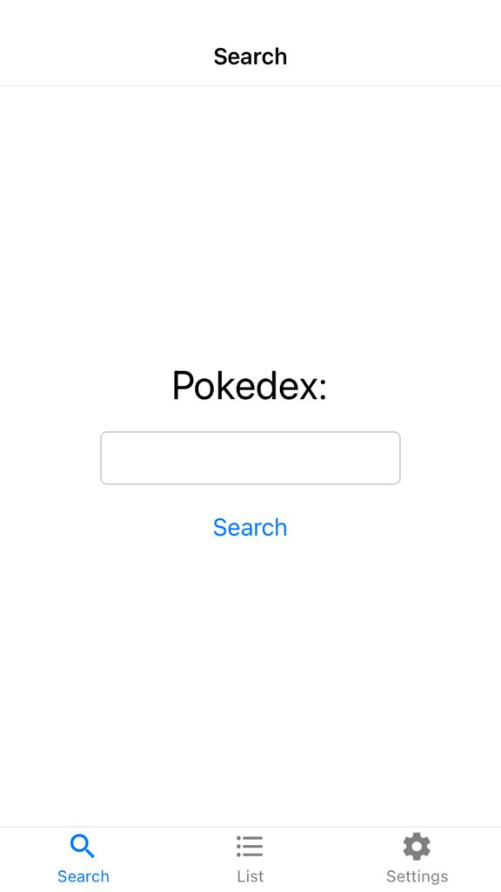
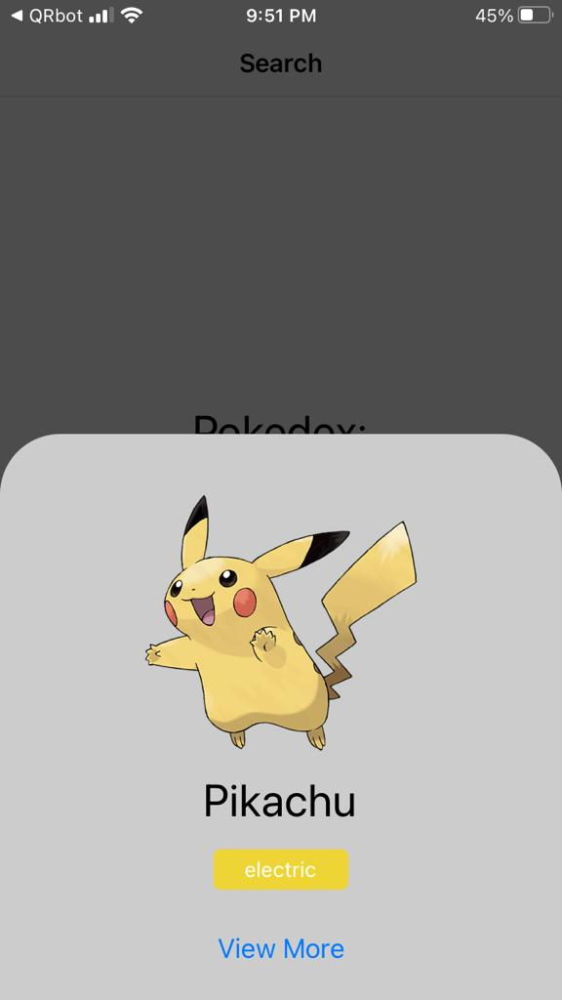
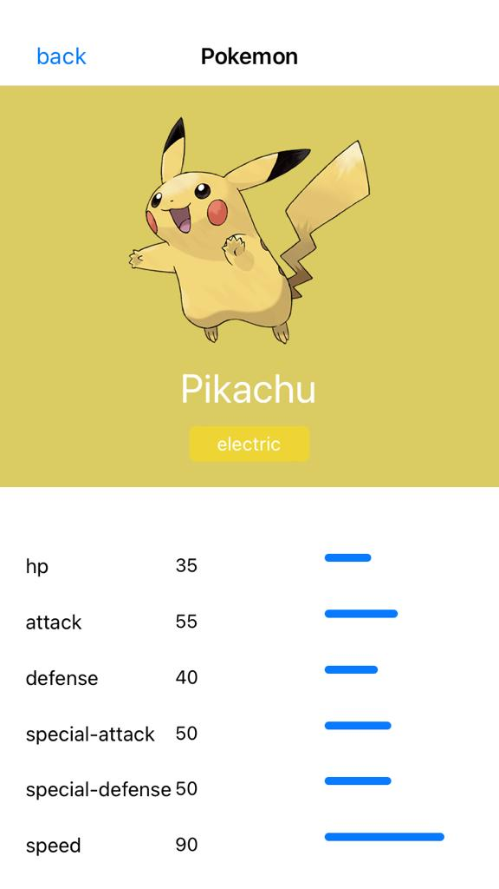
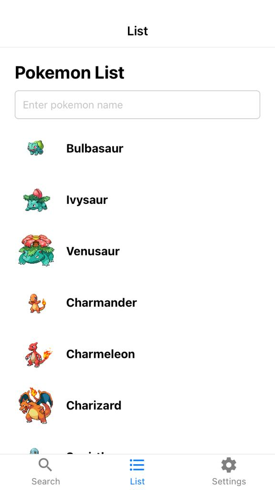
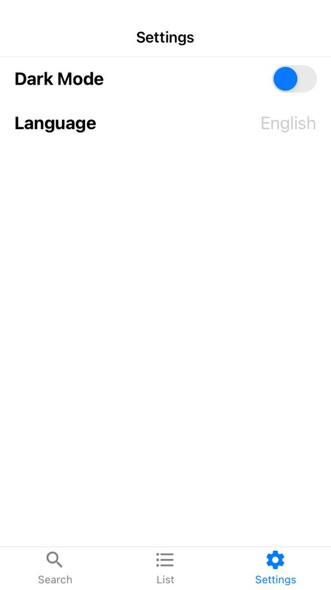
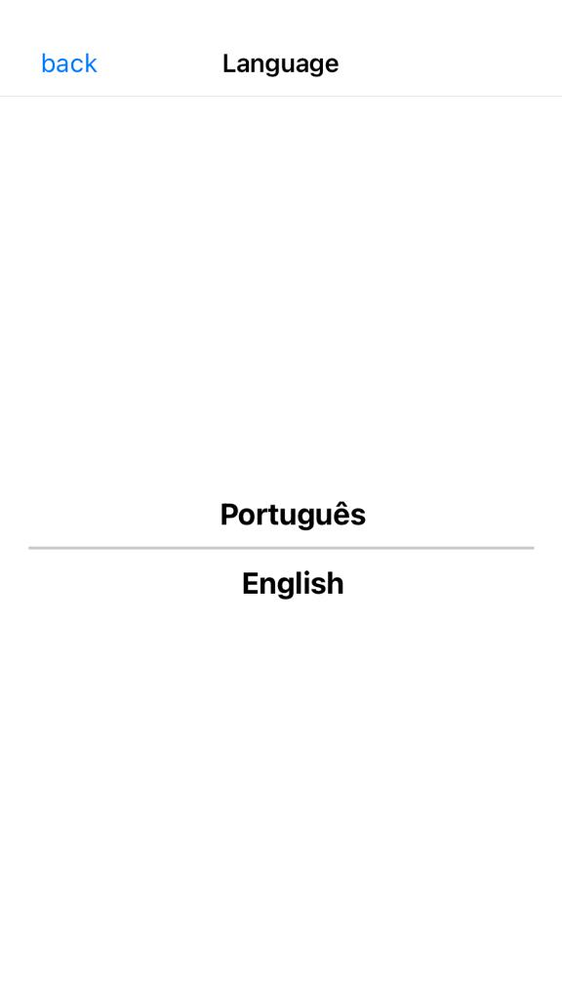
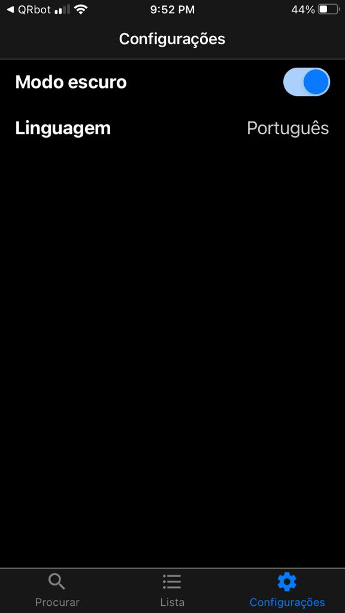

# Projeto pokedex em React Native

### Descrição
Nesse projeto eu utilizei o React Native, junto das técnologias/libs: axios, stackNavigation, tabNavigation, contextApi, styledComponents e React Native Modal. Para desenvolver o layout e as funcionalidades de um app de pokedex.

### Telas

#### Busca:

    
    
    

#### Lista:

    
    

#### Configurações:

    
    
    

